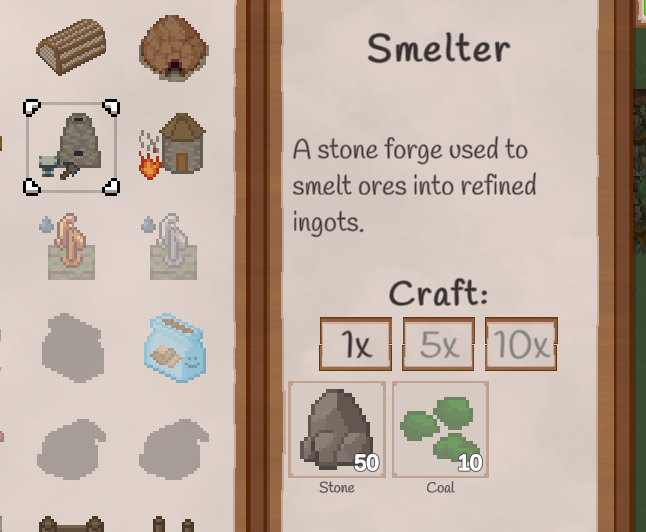
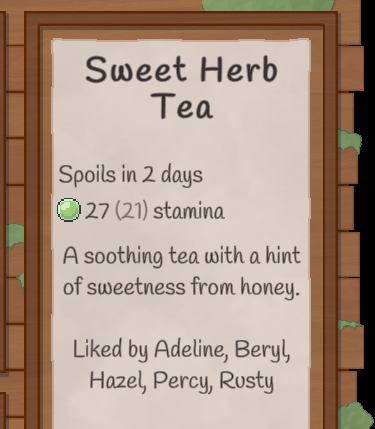
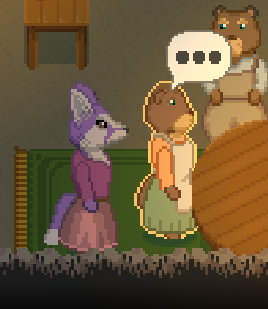
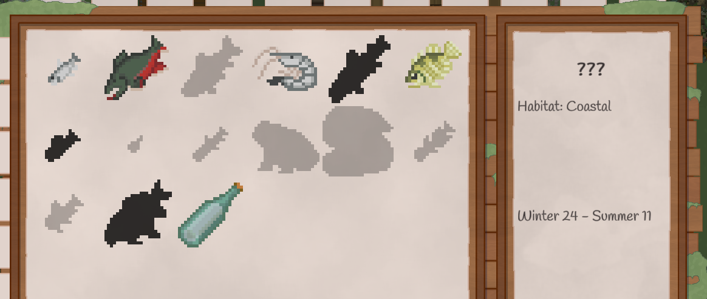
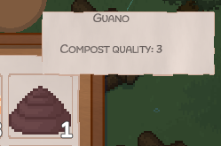

# Grimshire Tweaks
This is a mod for [Grimshire](https://store.steampowered.com/app/2238470/Grimshire/) that adds various QoL improvements and customization options without affecting core gameplay. See the [Features](#features) section for details.

- [Installation](#installation)
- [Features](#features)
  - [Quality of life](#quality-of-life)
  - [Control tweaks](#control-tweaks)
  - [Fixes and other changes](#fixes--other-changes)
- [Configuration](#configuration)

## Installation
The mod currently targets game version **v0.28.1**; beta versions are untested (but *might* still work).

- Download the latest version from [the releases page](https://github.com/PinewoodPip/GrimshireTweaks/releases)
- Extract the contents of the zip to the game folder *(right-click Grimshire in your Steam library -> "Manage" -> "Browse local files")*
    - The included BepInEx is a modloader for Unity, you can alternatively get it from [their repo](https://github.com/BepInEx/BepInEx); the additional shipped `.dlls` are unstripped assemblies from Unity required for it to run with Grimshire
    - If you already had BepInEx installed, you only need to copy `GrimshireTweaks.dll` file to `\Grimshire\BepInEx\plugins\`

If you've done everything properly, after launching the game you should see the plugin name & version in the title screen by the settings button:

## Features
Below is a list of features of the mod; most can be toggled through [a settings file as described below](#configuration).

### Quality of life

- The crafting table can now use ingredients from chests on your farm; no need to have everything in your player inventory
    - Items from your inventory are taken first
    - If an ingredient from the recipe is fulfilled by items in chests, it'll be highlighted in green to indicate so:

    

- The ⬆️ button in the cooking UI can prioritize pulling ingredients with lowest stamina value *(averaging the player & villager values)*
- Giftable items can show who likes the gift in the inventory panel *(if you've discovered the gift is liked)*, so you don't have to check the relationships tab as often:

    

- Villagers you haven't spoken to today yet can show a speech bubble when moused over (*Disabled by default*):

    

- The collection log can highlight unobtained fish/critters/seeds that are currently in season
    - Additionally, unobtained fish can show their habitat as a hint for where to find them:

    

- Compostable items can show their compost quality value in the inventory and tooltips *(while the composter UI is open)*:

    

- You can enable a *"It's getting late..."* notification to show when the clock hits 10PM, just so you don't forget to go to bed :P

### Control tweaks
*Most of these are disabled by default.*

- In dialogues, you can press the `Esc` key to select options like "Nevermind", "No", etc. to dismiss choices quicker
- You can invert the toolbar scroll direction, such that scrolling down moves to the slot on the right
    - This also applies to scrolling tabs in the pause menu
- You can reduce the cooldown for left-clicking in UIs, so you can ex. swap items around in the inventory quicker
- You can make the player run by default instead of walking

### Fixes & other changes

- If the cursor is over the toolbar, clicking a slot will no longer also try to interact with an object in the world
    - This fixes accidentally interacting with stuff while you're trying to switch slots by clicking them
- Optimized the checks for placing objects, reducing the massive lag that occurs when placing ex. tree seeds
    - Placement checks now occur only when the placement cursor moves to another tile, instead of 20 times per second
    - The `Physics2D.OverlapCircle()` calls were also replaced with non-alloc variants to reduce lag spikes from GC
        - There is still a lag spike coming from this particular call, however I'm unsure at the momment why (and why it only seems noticable with objects that have a 3x3 placement check)
    - This works under the assumption that the world grid cannot change while the player is holding the object to place, which AFAIK is the case (only the player can place/destroy objects?) 
- Added a setting to skip the splash screen, mostly useful to speed up testing while modding

## Configuration
After launching the game at least once with the mod, a config file will be created in `\Grimshire\BepInEx\config\GrimshireTweaks.cfg` where you can configure most of the mod's features. You need to restart the game to apply any changes.

 **Note that some features are disabled by default, mainly changes to controls**.

> [!NOTE]
> Support for changing settings in-game is planned for a future update.

## Licensing
"Acute Owl Studio" may use any source code from this repository without needing to give any attribution.
